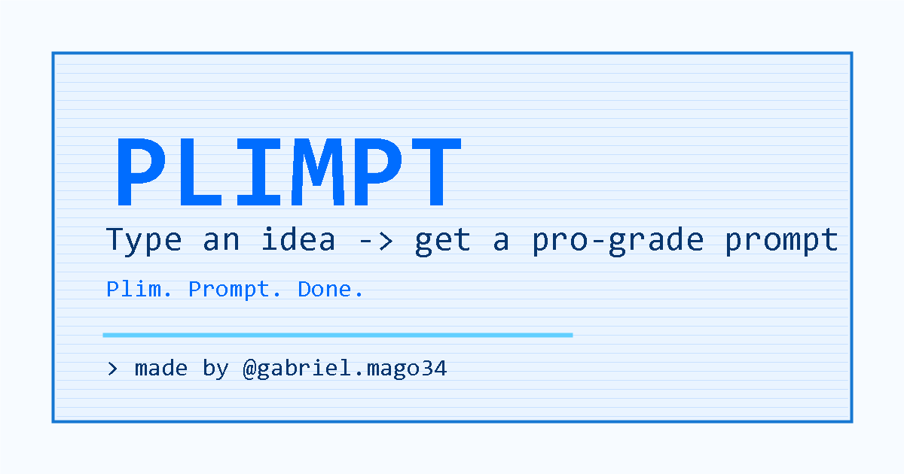

<div align="center">

```text
 ____  _     ___ __  __ ____ _____
|  _ \| |   |_ _|  \/  |  _ \_   _|
| |_) | |    | || |\/| | |_) || |
|  __/| |___ | || |  | |  __/ | |
|_|   |_____|___|_|  |_|_|    |_|
```

### Digite uma ideia -> receba um prompt profissional. Visual retrô, zero instalação, roda no navegador.

[](LICENSE)


[](https://instagram.com/gabriel.mago34)

**[Demo ao vivo](https://YOUR_USER.github.io/plimpt)** · [English](README.md) · [Contribuir template](CONTRIBUTING.md) · [Instagram @gabriel.mago34](https://instagram.com/gabriel.mago34)

</div>



## O que é?

PLIMPT transforma uma ideia vaga em um prompt detalhado e pronto para usar. Escolha uma categoria, escolha o modelo alvo, ajuste poucas opções, clique em **GENERATE** e copie.

- **23 categorias**: imagem, site, SaaS, código, escrita, marketing, música, vídeo, prompts de sistema e mais.
- **Saída adaptada por modelo**: XML para Claude, Markdown para GPT, checagem para Gemini, fórmula em vírgulas para modelos de imagem.
- **Interface CRT retrô**: visual claro branco/azul, scanlines, máquina de escrever, bips sintetizados e tela de boot.
- **100% no navegador**: suas ideias ficam no seu navegador. Sem conta, sem cookies, sem rastreamento.
- **Segurança por padrão**: CSP, permissões sensíveis desativadas, renderização local segura e sem backend.
- **Zero instalação**: HTML, CSS e JavaScript puros. Também vira PWA e funciona offline depois do primeiro carregamento.

## Como rodar

Sem etapa de build.

```bash
git clone https://github.com/YOUR_USER/plimpt.git
cd plimpt
python3 -m http.server 8080
```

Abra `http://localhost:8080`.

Você também pode publicar a pasta direto no GitHub Pages.

## Como funciona

```text
Sua ideia -> categoria + modelo + opções -> motor de prompts -> prompt pronto para copiar
```

O motor adiciona papel, contexto, tarefa, restrições, contrato de saída, exemplos opcionais, critérios de sucesso e formatação específica por modelo.

## Criado por

Feito com cuidado por **Gabriel**.

Instagram: [@gabriel.mago34](https://instagram.com/gabriel.mago34)

## Licença

MIT © Gabriel ([@gabriel.mago34](https://instagram.com/gabriel.mago34))
